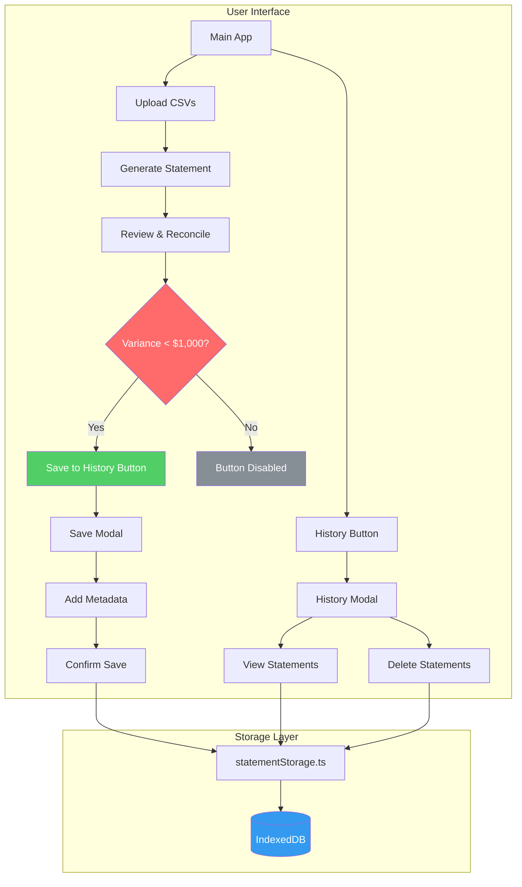
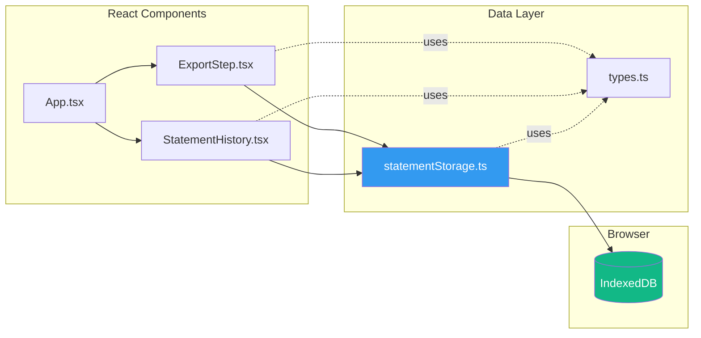
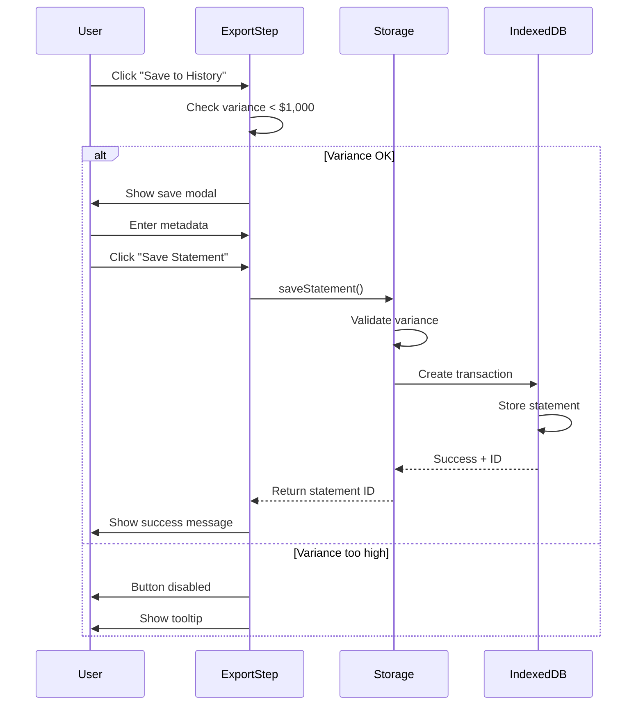
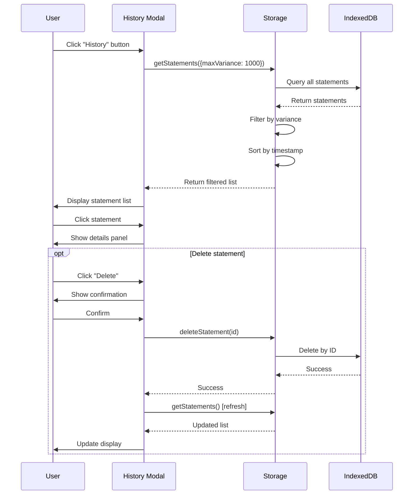
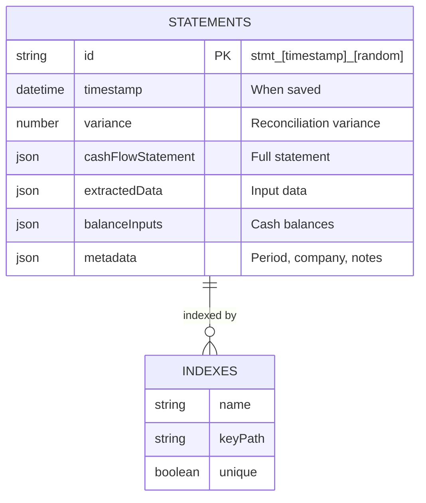
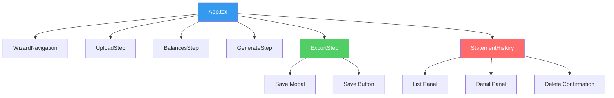
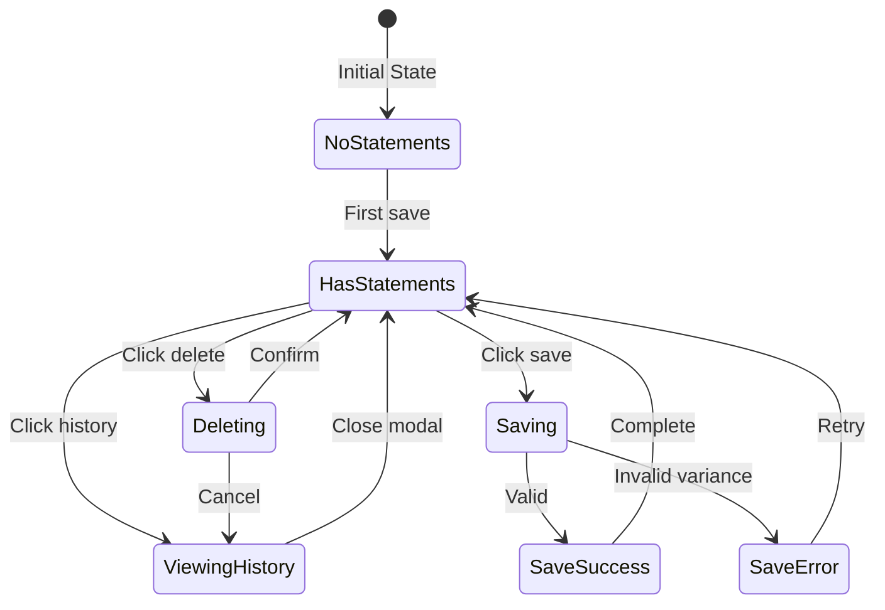
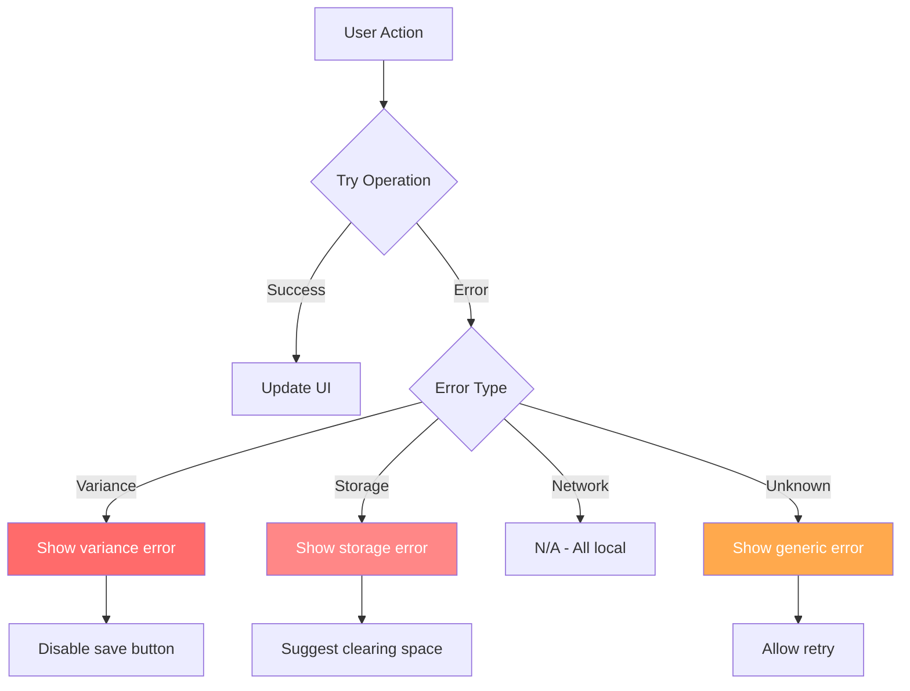
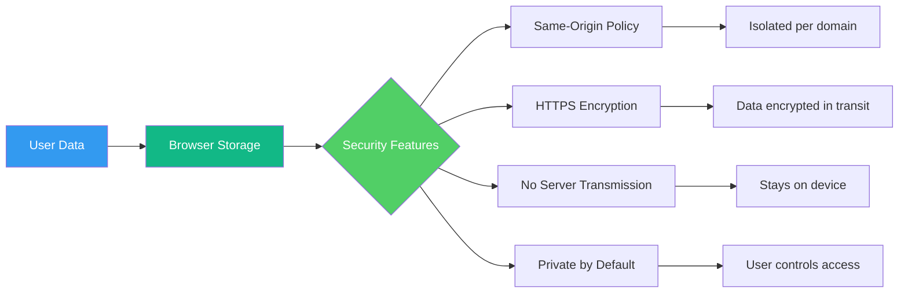

# Storage Backend Architecture

## System Overview



## Component Architecture



## Data Flow: Saving a Statement



## Data Flow: Viewing History



## Storage Schema



## IndexedDB Structure

```
Database: CashFlowStatementsDB (v1)
│
└── Object Store: statements
    ├── Key Path: id
    ├── Indexes:
    │   ├── timestamp (non-unique)
    │   └── variance (non-unique)
    └── Data:
        ├── id: "stmt_1234567890_abc123"
        ├── timestamp: Date
        ├── variance: number
        ├── cashFlowStatement: {...}
        ├── extractedData: {...}
        ├── balanceInputs: {...}
        └── metadata: {
            ├── periodLabel?: string
            ├── companyName?: string
            └── notes?: string
        }
```

## Component Hierarchy



## State Management



## Variance Threshold Logic

```mermaid
flowchart TD
    A[Calculate Variance] --> B{|variance| < 0.01?}
    B -->|Yes| C[Perfectly Balanced ✓]
    B -->|No| D{|variance| < 1000?}
    D -->|Yes| E[Reconciled - Can Save]
    D -->|No| F[Not Reconciled - Cannot Save]
    
    C --> G[Show green badge]
    E --> H[Show yellow badge]
    F --> I[Disable save button]
    
    style C fill:#51cf66,color:#fff
    style E fill:#ffd43b,color:#000
    style F fill:#ff6b6b,color:#fff
```

## Performance Characteristics

| Operation | Time | Notes |
|-----------|------|-------|
| Save Statement | < 50ms | Single IndexedDB write |
| Load All Statements | < 100ms | Up to 1000 statements |
| Filter by Variance | < 10ms | Using index |
| Delete Statement | < 30ms | Single transaction |
| Get Statement Count | < 20ms | Index scan |

## Storage Capacity

```
Browser Storage Hierarchy:
├── IndexedDB: 50MB - Unlimited (browser dependent)
│   └── Per Statement: ~5-10 KB
│       ├── Metadata: ~0.5 KB
│       ├── Statement Data: ~2-3 KB
│       ├── Extracted Data: ~1-2 KB
│       └── Balance Inputs: ~0.1 KB
│
├── Typical Capacity: 5,000 - 10,000+ statements
└── Quota Management: Browser handles automatically
```

## Error Handling



## Security Considerations



## Deployment Architecture

```
┌─────────────────────────────────────────┐
│           User's Browser                │
│                                         │
│  ┌───────────────────────────────────┐ │
│  │      React Application            │ │
│  │  (Static Files from CDN/Server)   │ │
│  └───────────────┬───────────────────┘ │
│                  │                      │
│                  ▼                      │
│  ┌───────────────────────────────────┐ │
│  │       IndexedDB Storage           │ │
│  │   (Browser's Local Storage)       │ │
│  └───────────────────────────────────┘ │
│                                         │
└─────────────────────────────────────────┘

No backend server required!
All data stored locally in browser.
```

---

**Note**: This architecture is designed to be simple, secure, and scalable for individual use cases. For enterprise deployments requiring multi-user collaboration or centralized storage, consider adding a backend API layer.
